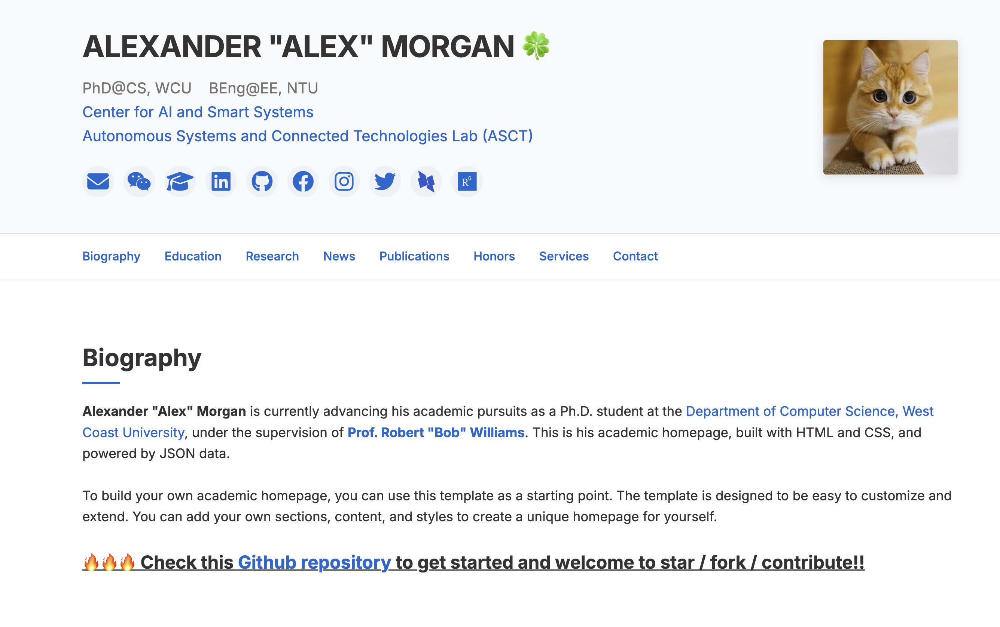

# Academic Homepage Modernism

A modern, responsive academic personal website showcasing expertise in environmental engineering and renewable energy research. This website is designed for researchers, professors, and PhD students specializing in environmental sustainability, renewable energy systems, carbon capture, and water treatment innovations.



**Check out the [live demo](https://academic-homepage-modernism.netlify.app/).**

## Features

- 📱 **Fully Responsive Design**: Adapts seamlessly to all devices from desktops to mobile phones
  - Mobile-optimized navigation with smooth horizontal scrolling
  - Smart active link centering and visual scroll indicators
  - Adaptive layout for various screen sizes
- 📊 **Dynamic Content**: JSON-powered content management for easy updates without HTML editing
- 🔍 **Publication Management**: 
  - Filtering system (All/Preprints/Accepted/First Author)
  - Clearly organized by research area with visual cues
  - Support for equal contribution notation and conference presentation highlights
- 📰 **Research News Section**: Showcase latest accomplishments, grants, and publications
- 🏆 **Honors & Awards Display**: Highlight recognition of research excellence
- 🤝 **Service & Teaching Section**: Document academic service and teaching contributions

## Table of Contents

1. [Project Overview](#project-overview)
2. [Site Structure](#site-structure)
3. [Getting Started](#getting-started)
4. [Content Management](#content-management)
   - [Data Files Structure](#data-files-structure)
   - [Profile Information](#profile-information)
   - [Research Publications](#research-publications)
   - [News & Updates](#news--updates)
5. [Customization Guide](#customization-guide)
   - [Updating Personal Information](#updating-personal-information)
   - [Customizing Research Areas](#customizing-research-areas)
   - [Managing Publications](#managing-publications)
   - [Updating Education History](#updating-education-history)
   - [Modifying Honors & Awards](#modifying-honors--awards)
   - [Managing Professional Services](#managing-professional-services)
   - [Updating Contact Information](#updating-contact-information)
6. [Advanced Customization](#advanced-customization)
   - [Changing Theme Colors](#changing-theme-colors)
   - [Updating Font Styles](#updating-font-styles)
   - [Adding New Sections](#adding-new-sections)
   - [Modifying Layout](#modifying-layout)
7. [Mobile Optimization](#mobile-optimization)
8. [Deployment Options](#deployment-options)
9. [Browser Compatibility](#browser-compatibility)
10. [License & Attribution](#license--attribution)

## Project Overview

This academic portfolio website is designed to effectively showcase environmental engineering and renewable energy research. The site provides a clean, professional presentation of academic credentials, research publications, and achievements focused on sustainability technologies.

Key areas featured include:
- Sustainable materials for renewable energy
- Water purification and treatment technologies
- Carbon capture and sequestration methods
- Integrated renewable energy management systems
- Environmental sustainability in developing regions
- Microgrid optimization for remote communities
- Waste management and circular economy approaches
- Smart irrigation and water conservation

## Site Structure

```
├── index.html                # Main homepage file
├── styles.css                # CSS styling
├── script.js                 # JavaScript functionality
├── assets/                   # Images and other static assets
│   ├── profile.jpg           # Profile photo
│   ├── logo1.jpeg            # University logo (West Coast University)
│   ├── logo2.png             # University logo (Northern Technical University)
│   ├── dblp.svg              # DBLP icon
│   └── wechat.jpg            # Social media QR code
├── data/                     # JSON data files for dynamic content
│   ├── news.json             # Research news and updates
│   ├── publications.json     # Research publications database
│   └── profile-info.json     # Personal and contact information
└── pages/                    # Additional pages
    └── all-news.html         # Complete archive of research news
```

## Getting Started

To adapt this website for your own academic portfolio:

1. Clone this repository:
```bash
git clone https://github.com/dl-m9/academic-homepage-modernism.git
```

2. Navigate to the project directory:
```bash
cd academic-homepage-modernism
```

3. Customize the JSON data files in the `data/` directory to update your information:
   - `profile-info.json`: Personal details and social media links
   - `publications.json`: Your research publications
   - `news.json`: News and updates about your research

4. Replace the image files in the `assets/` directory with your own:
   - Update `profile.jpg` with your professional photo
   - Replace university logos and other images as needed

5. Test your changes by opening `index.html` in a web browser.

## Content Management

### Data Files Structure

This website uses JSON files to manage content, allowing easy updates without editing HTML code.

### Profile Information

The `data/profile-info.json` file contains personal information, contact details, and social media links:

```json
{
  "name": "ALEXANDER \"ALEX\" MORGAN 🍀",
  "subtitle": "PhD@CS, WCU &nbsp;&nbsp; BEng@EE, NTU<br><a href=\"#\">Center for AI and Smart Systems</a><br><a href=\"#\">Autonomous Systems and Connected Technologies Lab (ASCT)</a>",
  "socialLinks": [
    {
      "type": "email",
      "url": "mailto:alex.morgan@example.com",
      "icon": "<i class=\"fas fa-envelope\"></i>"
    },
    // Additional social links...
  ],
  "profileImage": "assets/profile.jpg"
}
```

Key components to customize:
- `name`: Your full name (supports HTML formatting)
- `subtitle`: Your credentials, affiliations, and laboratories (supports HTML)
- `socialLinks`: Array of social media and professional profiles
- `profileImage`: Path to your profile photo

### Research Publications

The `data/publications.json` file organizes your publications with metadata for filtering:

```json
[
  {
    "number": 1,
    "title": "Sustainable Materials for High-Efficiency Solar Energy Storage Systems",
    "authors": "<strong><u>Alexander \"Alex\" Morgan</u></strong>, Jennifer Lee, Michael Taylor, Sarah Johnson, David Chen, Thomas Wright, Robert Williams",
    "type": "preprint",
    "isFirstAuthor": true,
    "tags": [
      {
        "text": "Preprint",
        "class": "preprint-tag"
      },
      {
        "text": "PDF",
        "class": "code-tag",
        "link": "#"
      }
    ]
  },
  // Additional publications...
]
```

For each publication, you can specify:
- `number`: Sequential identifier for ordering
- `title`: Publication title
- `authors`: Author list with HTML formatting to highlight your name
- `type`: "preprint" or "accepted"
- `isFirstAuthor`: Boolean indicating if you're the first author
- `venue`: For accepted papers, the conference or journal name
- `tags`: Links to resources (PDF, code, blog posts) with appropriate styling classes

### News & Updates

The `data/news.json` file contains research updates, achievements, and announcements:

```json
[
  {
    "date": "Mar. 2025",
    "title": "New Project Launched: <a href='#'>Sustainable Energy Solutions</a>",
    "content": "🔥🔥🔥 We launched a new research initiative on Sustainable Energy Solutions! This project will focus on developing innovative approaches to renewable energy storage and distribution for urban environments. Join our open-source collaboration!",
    "links": [
      {
        "text": "Github Repository",
        "url": "#"
      }
    ]
  },
  // Additional news items...
]
```

Each news item includes:
- `date`: When the news occurred (Month YYYY format)
- `title`: Headline for the news item (supports HTML)
- `content`: Detailed description (supports HTML and emoji)
- `links`: Optional array of related resources

## Customization Guide

### Updating Personal Information

1. **Basic Profile**:
   - Edit `data/profile-info.json` to update your name, title, and affiliations
   - Replace the profile photo in `assets/profile.jpg` (recommended size: 500x500px)

2. **Social Media & Contact Links**:
   - Modify the `socialLinks` array in `profile-info.json`
   - Each link needs a type, URL, icon, and optional target attribute
   - Icons use Font Awesome classes (see [Font Awesome](https://fontawesome.com/icons))

### Customizing Research Areas

Edit the Research Interests section in `index.html`:

```html
<section id="research" class="section">
    <div class="container">
        <h2 class="section-title">Research Interests</h2>
        <div class="research-areas">
            <div class="research-area">
                <i class="fas fa-sun"></i>
                <h3>Renewable Energy Systems</h3>
                <ul class="research-list">
                    <li><strong>Solar Energy Storage Solutions:</strong> Description...</li>
                    <li><strong>Microgrid Optimization:</strong> Description...</li>
                </ul>
            </div>
            <!-- Additional research areas... -->
        </div>
    </div>
</section>
```

For each research area:
1. Choose an appropriate Font Awesome icon that represents the topic
2. Update the heading to reflect your area of expertise
3. List specific subfields with brief descriptions of your work

### Managing Publications

To update your publications:

1. Edit `data/publications.json` following the structure outlined above
2. For new publications:
   - Assign a unique number (typically sequential)
   - Format author names with your name highlighted using HTML tags
   - Set the correct publication type and first author status
   - Add relevant tags with links to resources
   - For accepted papers, include the venue information

Publications are automatically categorized and can be filtered using the buttons in the publications section.

### Updating Education History

Modify the education timeline in `index.html`:

```html
<div class="timeline-item">
    <div class="timeline-marker"></div>
    <div class="timeline-content">
        <div class="edu-content-wrapper">
            <div class="edu-text">
                <h3>PhD @ West Coast University (WCU)</h3>
                <p class="timeline-date">Aug. 2023 - Now</p>
                <p>Computer Science</p>
                <p>Supervisor: <a href="#">Prof. Robert "Bob" Williams</a> (Chair Professor of AI, ACM, IEEE, and AAAS Fellow)</p>
            </div>
            <div class="school-logo">
                
            </div>
        </div>
    </div>
</div>
```

For each education entry:
1. Update the degree, university name, and acronym
2. Set the correct date range
3. Update the field of study
4. Include supervisor information and notable achievements
5. Replace the university logo image in the `assets/` folder

### Modifying Honors & Awards

Update the honors and awards section in `index.html`:

```html
<div class="honor-item">
    <div class="honor-year"><span class="year-highlight">2023</span></div>
    <div class="honor-content">
        <h3>University Research Tuition Grant</h3>
        <p>West Coast University</p>
        <p>$35,000 to cover part of tuition fees during PhD.</p>
    </div>
</div>
```

For each award:
1. Set the correct year in the `honor-year` div
2. Update the award name in the heading
3. Include the awarding organization or institution
4. Add relevant details about the award (amount, significance, etc.)

### Managing Professional Services

Modify the services section in `index.html` to reflect your academic service and teaching experience:

```html
<div class="service-category">
    <h3>Conference Technical Program Committee & Reviewer</h3>
    <ul class="service-list">
        <li>Conference Name'YY</li>
        <!-- Additional conferences... -->
    </ul>
</div>
```

Organize services into categories such as:
- Conference committees and reviewing
- Journal reviewing
- Teaching experience
- Workshop organization
- Professional memberships

### Updating Contact Information

To update your contact information:

1. Modify the address in the Contact section of `index.html`:
```html
<div class="address-info">
    <h3>Office Address</h3>
    <p><i class="fas fa-map-marker-alt"></i> 123 University Drive, West Coast, CA 90210, USA</p>
</div>
```

2. Update the Google Maps iframe embed with your location:
```html
<iframe 
    src="https://www.google.com/maps/embed?pb=!1m18!..." 
    width="100%" 
    height="400" 
    style="border:0;" 
    allowfullscreen="" 
    loading="lazy" 
    referrerpolicy="no-referrer-when-downgrade">
</iframe>
```

To get a new Google Maps embed code:
1. Go to [Google Maps](https://www.google.com/maps)
2. Search for your location
3. Click "Share" and then "Embed a map"
4. Copy the provided iframe HTML code

## Advanced Customization

### Changing Theme Colors

To modify the color scheme, edit the CSS variables in `styles.css`:

```css
:root {
    --primary-color: #0066cc; /* Main accent color */
    --secondary-color: #f8f9fa; /* Section background color */
    --text-color: #333; /* Main text color */
    --light-text: #757575; /* Secondary text color */
    --border-color: #e0e0e0; /* Border color */
    /* Additional color variables... */
}
```

For an environmental theme, consider using:
- Green tones for sustainability focus
- Blue tones for water research
- Earth tones for environmental focus

### Updating Font Styles

To change the typography:

1. Update the Google Fonts link in the `<head>` section of `index.html`:
```html
<link href="https://fonts.googleapis.com/css2?family=Inter:wght@300;400;500;600;700&display=swap" rel="stylesheet">
```

2. Modify the font-family in `styles.css`:
```css
body {
    font-family: 'Inter', sans-serif;
}
```

### Adding New Sections

To add a new section:

1. Create the section HTML in `index.html`:
```html
<section id="new-section-id" class="section">
    <div class="container">
        <h2 class="section-title">New Section Title</h2>
        <!-- Section content here -->
    </div>
</section>
```

2. Add a navigation link in the nav bar:
```html
<li><a href="#new-section-id">New Section</a></li>
```

3. Add any necessary CSS styles in `styles.css`

### Modifying Layout

To change the layout structure:

1. Adjust the container width in `styles.css`:
```css
.container {
    max-width: 1140px; /* Adjust as needed */
    margin: 0 auto;
    padding: 0 20px;
}
```

2. Modify the grid structure for specific sections:
```css
.research-areas {
    display: grid;
    grid-template-columns: repeat(auto-fit, minmax(300px, 1fr));
    gap: 2rem;
}
```

## Mobile Optimization

This website includes several mobile-specific optimizations:

1. **Responsive Navigation**:
   - Horizontal scroll navigation on mobile devices
   - Visual indicators show when more menu items are available
   - Active items automatically center in the viewport
   - Touch-friendly scrolling behavior

2. **Content Adaptation**:
   - Stacked layout for mobile devices
   - Properly sized touch targets for interface elements
   - Readable font sizes on small screens
   - Optimized spacing for mobile viewing

3. **Performance Optimizations**:
   - Lazy loading for map and images
   - Minimal dependencies for faster loading
   - Efficient CSS with media queries

To further customize mobile behavior, edit the media queries in `styles.css`:

```css
@media (max-width: 768px) {
    /* Tablet styles */
}

@media (max-width: 576px) {
    /* Mobile phone styles */
}
```

## Deployment Options

There are several ways to deploy your environmental engineering portfolio:

1. **GitHub Pages** (Free):
   - Push your repository to GitHub
   - Enable GitHub Pages in the repository settings
   - Site will be available at `https://yourusername.github.io/repository-name`
   - Instructions: [GitHub Pages Documentation](https://docs.github.com/en/pages)

2. **Netlify** (Free tier available):
   - Create an account on [Netlify](https://www.netlify.com/)
   - Connect to your GitHub repository or upload your files directly
   - Configure build settings if needed (not required for this static site)
   - Optionally set up a custom domain
   - Instructions: [Netlify Documentation](https://docs.netlify.com/)

3. **University Web Hosting**:
   - Many universities provide web space for faculty and students
   - Contact your university IT department for access details
   - Upload the files via FTP or the provided web interface
   - Your site will typically be available at `https://university.edu/~username`

4. **Custom Web Hosting**:
   - Purchase hosting from providers like NameCheap, Bluehost, or SiteGround
   - Register a domain name (e.g., `www.yourname.com`)
   - Upload the website files via FTP or the hosting control panel
   - Point your domain to the hosting provider

## Browser Compatibility

This website is optimized for modern browsers including:
- Chrome 70+
- Firefox 63+
- Safari 12+
- Edge 79+
- Opera 57+
- Mobile browsers (iOS Safari, Android Chrome)

For older browsers, some advanced CSS features may not display correctly, but content will remain accessible.

## License & Attribution

This project is available under the MIT License. You are free to use, modify, and distribute this template for both personal and academic purposes.

When using this template, attribution is appreciated but not required.

